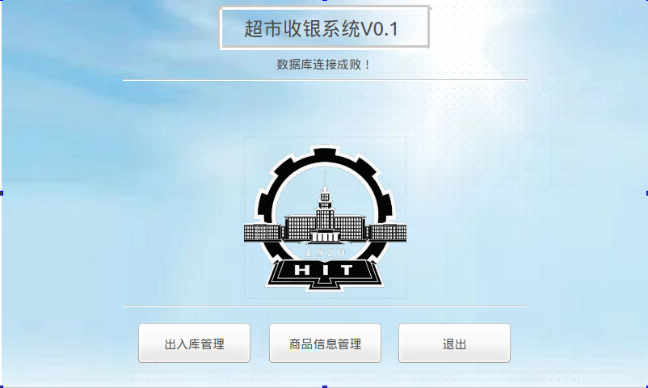
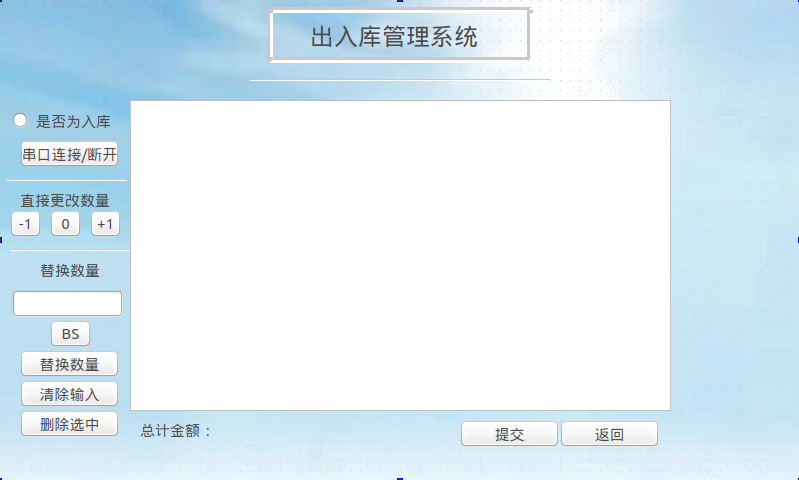
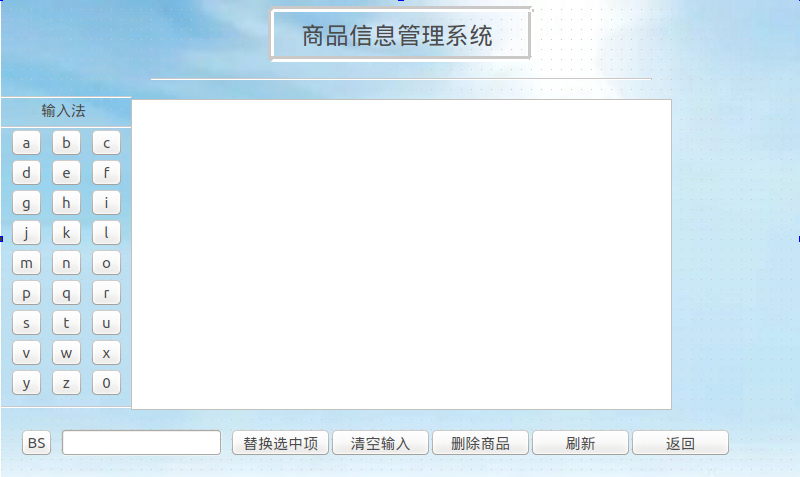

## 1.简介

> + 基于IMX6的简单的收银系统，使用条码扫描枪来扫描条码，进行收银、入库与库存管理，在ARM架构嵌入式Linux下运行；使用Qt/C++编写。
> + 代码详见GitHub: [https://github.com/Riesenwelle/RS-232-Imbedded-Cashier](https://github.com/Riesenwelle/RS-232-Imbedded-Cashier)

---

## 2.文件/类功能介绍

> + dbconnect.h: 包含其他头文件要用到的标准头文件
> + src.qrc: Qt 资源库文件，包含图片 bluesky.png 和 hit.png
> + Widget: 主窗口，负责SQLite数据库连接，以及跳转到其他窗口
> + IOManager: 出入库管理窗口，负责创建子线程连接串口，进行商品出入库
> + InfoManager: 库存管理窗口，负责管理库存商品信息
> + UartThread: 负责定义连接串口子线程的操作，在子线程中使用信号/槽机制向主线程传递参数
> + ProgressBarTest: 图形界面测试用，无实际作用
> + functionmanagement: 组内成员的处理前代码，无实际作用
> + uart/uart2: 失败尝试的遗留代码，无实际作用

---

## 3.一些注意点
 
> + 使用的RS-232串口为: /dev/ttyS3  
> + 串口波特率设置为: B9600  
> + 使用的条码扫描枪为: Easytech STK-888  
> + 配置手册可见: [https://www.docin.com/p-743441628.html](https://www.docin.com/p-743441628.html)  
> + 使用SQLite3数据库进行数据的存取  
> + 由于实验箱自带1-9硬按键输入，软键盘中没有设置数字1-9  
> + 答案是 HITWH 的嵌入式课设

---

## 4.截图

### 4.1 主界面

### 4.2 出入库管理界面

### 4.3 库存管理界面
