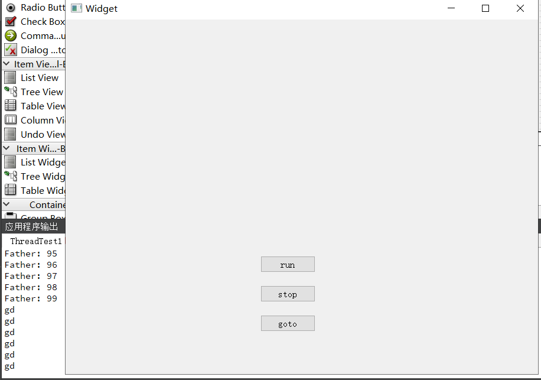

Qt中通过继承QThread并重写run()方法的方式实现多线程代码的编写。
下面是一个简单的实例，替换run中的函数，结合槽函数即可实现其他复杂功能。

代码如下：

## widget.h
``` C++
#ifndef WIDGET_H
#define WIDGET_H

#include <QWidget>
#include "mythread.h"
#include "dialog.h"

#include <iostream>

using namespace std;

QT_BEGIN_NAMESPACE
namespace Ui { class Widget; }
QT_END_NAMESPACE

class Widget : public QWidget
{
    Q_OBJECT

public:
    Widget(QWidget *parent = nullptr);
    ~Widget();

private slots:
    void on_pushButton_clicked();

    void on_pushButton_2_clicked();

    void on_pushButton_3_clicked();

private:
    Ui::Widget *ui;
    MyThread* thy;
    Dialog* dialog = new Dialog;
};
#endif // WIDGET_H

```
## widget.cpp
``` C++
#include "widget.h"
#include "ui_widget.h"

Widget::Widget(QWidget *parent)
    : QWidget(parent)
    , ui(new Ui::Widget)
{
    ui->setupUi(this);
}

Widget::~Widget()
{
    delete ui;
}

// 跑
void Widget::on_pushButton_clicked()
{
    thy = new MyThread();
    thy->start();
    for(int i = 0 ; i < 100 ; i++)
    {
        qDebug() << "Father:" << i;
    }
}

// 停
void Widget::on_pushButton_2_clicked()
{
    thy->terminate(); // 暴力中止
}

void Widget::on_pushButton_3_clicked()
{
    dialog->show();
}
```
## mythread.h
``` C++
#ifndef MYTHREAD_H
#define MYTHREAD_H

#include <QObject>
#include <QThread>
#include <QDebug>

class MyThread : public QThread
{
public:
    MyThread();

protected:
    void run();
};

#endif // MYTHREAD_H
```
## mythread.cpp
``` C++
#include "mythread.h"

MyThread::MyThread()
{

}

void MyThread::run()
{
    while(1)
    {
        qDebug() << "gd";
        sleep(1);
    }
}
```
---
### 实际GUI效果如下（PushButton从上到下分别对应1-3）：
> + 单击run后持续在控制台用qDebug输出"gd"，且不卡死Qt GUI主线程：
> + 单击stop后停止子线程。
